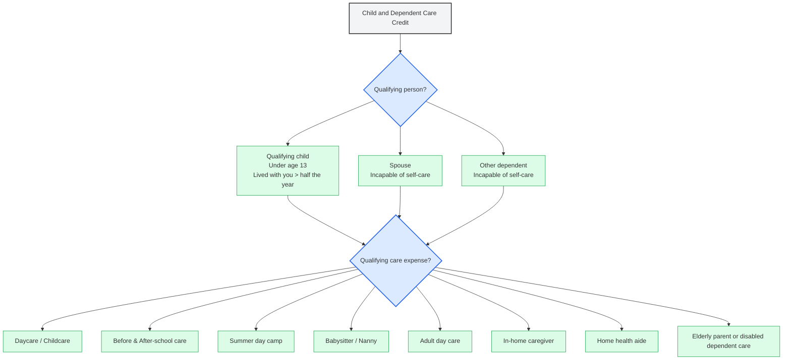

```mermaid
flowchart TD

A["Child and Dependent Care Credit"] --> B{"Qualifying person?"}

B --> C["Qualifying child<br/>Under age 13<br/>Lived with you > half the year"]
B --> D["Spouse<br/>Incapable of self-care"]
B --> E["Other dependent<br/>Incapable of self-care"]

C --> G{"Qualifying care expense?"}
D --> G
E --> G

G --> H["Daycare / Childcare"]
G --> I["Before & After-school care"]
G --> J["Summer day camp"]
G --> K["Babysitter / Nanny"]
G --> L["Adult day care"]
G --> M["In-home caregiver"]
G --> N["Home health aide"]
G --> O["Elderly parent or disabled dependent care"]

%% Styling
classDef main fill:#f3f4f6,stroke:#333,stroke-width:2px;
classDef decision fill:#dbeafe,stroke:#2563eb,stroke-width:2px;
classDef category fill:#dcfce7,stroke:#16a34a,stroke-width:1px;

class A main;
class B,G decision;
class C,D,E,H,I,J,K,L,M,N,O category;

```
