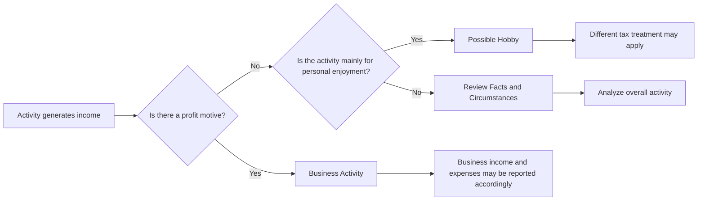

# Hobby vs. Business: Tax Decision Tree

This decision tree helps explain the thought process behind classifying an income-producing activity as a hobby or a business.

## Decision Tree

```mermaid
flowchart LR
    A[Activity generates income] --> B{Is there a profit motive?}

    B -->|Yes| C[Business Activity]
    B -->|No| D{Is the activity mainly for personal enjoyment?}

    D -->|Yes| E[Possible Hobby]
    D -->|No| F[Review Facts and Circumstances]

    C --> G[Business income and expenses may be reported accordingly]
    E --> H[Different tax treatment may apply]
    F --> I[Analyze overall activity]
```
